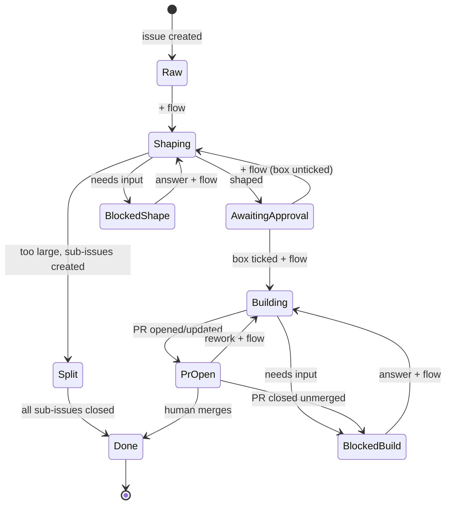

# issue-driven-flow

[English](README.md) | [日本語](README.ja.md)

[](https://github.com/4moda/issue-driven-flow/actions/workflows/ci.yml)

GitHub 向けの Issue 駆動 AI 開発フローを、複数リポジトリで共有します。

人間が操作するのは **1つのラベルと1つのチェックボックス** だけです。Issue に
`flow` を付けると次の自動化ステップが実行され、`ready for implementation` に
チェックを入れると実装が承認されます。コーディングエージェント ——
**Claude Code・Codex・Gemini CLI** のうち、提供したシークレットから選択され
たもの —— が GitHub Actions 内で実行されます: **Composer** が未整形の Issue
を実装可能な仕様に整え、**Crafter** が承認済みの Issue をプルリクエストとし
て実装します。**マージは常に人間が行います。** 内部の `flow/*` ステートラベ
ルはすべて自動化によって管理されます。



## リポジトリへの導入

ラッパーワークフロー1つ、認証情報1つ、ラベルセットアップの実行1回。詳細は
[docs/adopting.ja.md](docs/adopting.ja.md) を参照してください。

## AI が実行される場所・されない場所

AI が呼び出されるのは **正確に2つのステップ** だけです:

1. `shape.yml` の Composer ステップ（Issue の書き直し・分割）、および
2. `build.yml` の Crafter ステップ（作業ツリーの編集）。

それ以外はすべて `gh` と単体テスト済みの Python モジュール（`scripts/gf.py`）
による決定的なスクリプト処理です。ステートラベルによる `flow` トリガーの
ルーティング、承認チェックボックスの解析、サブ Issue の作成、コミット・
プッシュと PR のオープン、マージ・クローズ・レビュー結果の Issue への反映
（`sync-pr.yml` には AI が一切含まれません）。エージェント自身が GitHub API
を呼び出すことはなく、ワークフローが検証して機械的に適用する結果ファイルを
書き出すだけなので、すべてのステート遷移はログから説明可能です。

<a id="security-model"></a>

## セキュリティモデル

- **認証情報は利用側リポジトリが所有します。** 各利用側リポジトリは、GitHub
  Actions のシークレットとして独自のエージェント認証情報
  （`ANTHROPIC_API_KEY` / `CLAUDE_CODE_OAUTH_TOKEN`、`OPENAI_API_KEY`、
  または `GEMINI_API_KEY`）を提供し、ワークフローは対応するエージェントを
  実行します。このリポジトリが配布するのはコードのみで、誰のトークンも
  受け取らず、保存せず、中継もしません。
- **エージェントの認証情報は、そのベンダーの API にのみ送信され、それ以外
  には送信されません。** 利用側リポジトリ自身のランナー上で動作する各ベン
  ダーの公式アクション
  （[`anthropics/claude-code-action`](https://github.com/anthropics/claude-code-action)、
  [`openai/codex-action`](https://github.com/openai/codex-action)、
  [`google-github-actions/run-gemini-cli`](https://github.com/google-github-actions/run-gemini-cli)）
  がこれを利用します。機械的なステップは、実行時の `GITHUB_TOKEN` を使って
  `github.com` とのみ通信します。GitHub はログ内のシークレットをマスクしま
  す。
- **`GITHUB_TOKEN` は使い捨てで最小権限です。** ジョブが終了すると失効し、
  ラッパーワークフローはジョブごとに最小限の `permissions` を宣言します
  （shape が `contents: write` を得ることはなく、sync-pr がコードにアクセス
  することもありません）。
- **GitHub の外部に出る情報:** 2つの AI ステップの実行中は、リポジトリの
  内容や Issue/PR のテキストがモデルのコンテキストとして選択された
  エージェントのモデル API に送信されます —— これはコーディングエージェント
  を実行する上で本質的なものです。また、エージェントが外部の事実を確認でき
  るよう、Web 調査ツール（検索・フェッチ）がデフォルトで有効です。モデル
  API 以外をオフラインに保つには `web_research: false` で無効化できます。
  機械的なステップの実行中は、どこにも何も送信されません。
- **影響範囲は設計上限定されています**: エージェントはプッシュ・マージ・
  ラベル付けを行えません。それらはワークフローが決定的に行い、マージは常に
  人間に委ねられます。エージェント実行用のチェックアウトは git 認証情報を
  保持せず（`persist-credentials: false`）、ワークフロー自身の publish ステ
  ップでのみ再認証します。Codex と Gemini の実行には GitHub トークンを一切
  渡しません。また各エージェントはツール許可リストの下で動作します
  （Composer にはシェルがなく、Crafter には `git push`/`gh` が拒否され
  ます）。

## 仕組み

- [skills/issue-driven-flow/SKILL.md](skills/issue-driven-flow/SKILL.md) —— 運用モデル、
  役割、設計ルール。
- [skills/issue-driven-flow/references/concepts.md](skills/issue-driven-flow/references/concepts.md)
  —— ステートマシン、ルーティングテーブル、不変条件、エッジケース。
- [skills/issue-driven-flow/references/composer.md](skills/issue-driven-flow/references/composer.md)
  / [crafter.md](skills/issue-driven-flow/references/crafter.md) —— エージェントが
  従う固定の契約。

## レイアウト

| Path | 用途 |
|------|------|
| `.github/workflows/shape.yml` | 再利用可能ワークフロー: Issue を整形する（Composer） |
| `.github/workflows/build.yml` | 再利用可能ワークフロー: Issue を実装する（Crafter） |
| `.github/workflows/sync-pr.yml` | 再利用可能ワークフロー: PR の結果を Issue に反映する。`flow/split` の親 Issue はすべてのサブ Issue がクローズされたらクローズする |
| `.github/workflows/ci.yml` | このリポジトリのテスト + lint |
| `actions/route` | 共有のルーティング判定（`scripts/gf.py` をラップ） |
| `actions/build-context` | エージェント実行用の Issue/PR/リポジトリコンテキストを収集 |
| `actions/update-issue` | `flow/*` ラベル、本文、コメント、Issue のオープン/クローズ状態を書き込む唯一の存在 |
| `actions/split-status` | クローズされた Issue の `flow/split` 親と、すべてのサブ Issue がクローズ済みかどうかを解決する |
| `scripts/gf.py` | テスト済みの判定ロジック（ステート、承認チェックボックス、ルーティング） |
| `scripts/setup-labels.sh` | 利用側リポジトリに `flow` + `flow/*` ラベルを作成する |
| `skills/issue-driven-flow/` | スキルドキュメントとエージェント契約 |
| `tests/` | `gf.py` の単体テスト |

再利用可能ワークフローは（`workflow_call` に関する GitHub の要件により）
`.github/workflows/` 配下に置かれており、Issue #1 で当初想定されていた
`workflows/` ディレクトリではありません。

## 開発

```bash
python3 -m unittest discover -s tests   # unit tests
pipx run ruff check scripts tests       # python lint
shellcheck scripts/*.sh                 # shell lint
actionlint                              # workflow lint
```

CI はすべての push と pull request でこの4つを実行します。

## リリース

利用側はメジャータグ（`@v2`、現行ライン）を固定し、ワークフロー内部のアク
ション参照も同じタグを使用します。タグ付けは
[`release.yml`](.github/workflows/release.yml) によって自動化されています:

- プロダクト本体（再利用可能ワークフロー、`actions/`、`scripts/`、
  `skills/`）に触れる `main` へのすべての push は、テスト + lint を通過した
  上で **patch** リリースとしてタグ付けされ（自動生成されたノート付きの
  GitHub Release）、移動するメジャータグが進みます。ドキュメントやテストの
  みの push はリリースされません。
- そのプッシュを **minor** リリースにするには、先頭のコミットメッセージに
  `[release:minor]` を含めます。`[release:skip]` はリリースを抑制します。
- **Major** リリースは設計上手動です —— 後方互換性の判断が必要になるためで
  す。まず内部のアクション参照（例: `@v2` → `@v3`）とドキュメントを更新する
  コミットを取り込み、その後 `release` ワークフローを *Run workflow* から
  `bump: major` で実行します。内部参照が対象ラインと一致しない間、ワーク
  フローはタグ付けを拒否し、メジャー準備用コミットでは自動 patch リリース
  が自身をスキップします。

破壊的変更（ラベル名、result.json のスキーマ、ラッパーの入力/シークレット）
は、現行タグを進めるのではなく新しいメジャータグを得ます。旧ラインはそのま
ま凍結されます。履歴: `v1`（v1.3.0 で凍結）はトリガーラベルとして `ai` を
使用していました。`v2` でこれを `flow` に改名し、設定可能にしました。
