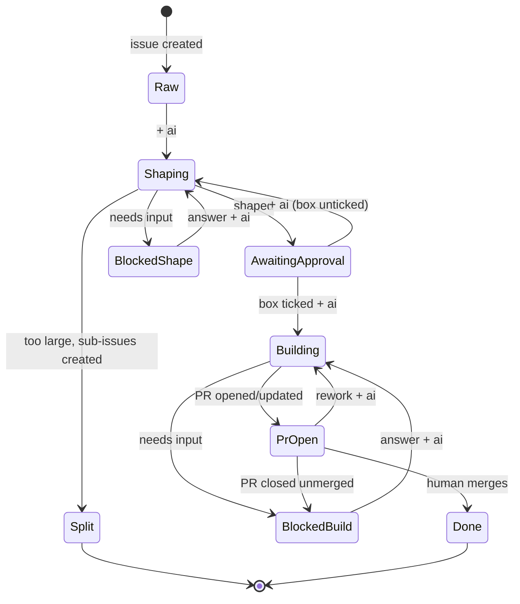

# github-flow

[](https://github.com/4moda/github-flow/actions/workflows/ci.yml)

Issue-driven AI development for GitHub, shared across repositories.

Humans steer with **one label and one checkbox**: add `ai` to an issue to
run the next automated step; tick `ready for implementation` to approve
implementation. Claude runs inside GitHub Actions — the **Composer** shapes
raw issues into implementable specs, the **Crafter** implements approved
issues as pull requests. **Merging is always a human action.** Internal
`flow/*` state labels are managed entirely by automation.



## Use it in a repository

One wrapper workflow, one credential, one label-setup run. See
[docs/adopting.md](docs/adopting.md).

## Where AI runs — and where it doesn't

AI is invoked in **exactly two steps**:

1. the Composer step of `shape.yml` (rewrite/split an issue), and
2. the Crafter step of `build.yml` (edit the working tree).

Everything else is deterministic scripting with `gh` and a unit-tested
Python module (`scripts/gf.py`): routing `ai` triggers by state label,
parsing the approval checkbox, creating sub-issues, committing/pushing and
opening PRs, and mirroring merge/close/review outcomes back to issues
(`sync-pr.yml` contains no AI at all). The agents themselves never call the
GitHub API — they only write result files that the workflows validate and
apply mechanically, so every state transition is explainable from logs.

## Security model

- **Credentials are the consumer's own.** Each consuming repository
  provides its own `ANTHROPIC_API_KEY` or `CLAUDE_CODE_OAUTH_TOKEN` as a
  GitHub Actions secret. This repository ships code only — it never
  receives, stores, or proxies anyone's tokens.
- **The Claude credential is sent to the Anthropic API and nowhere else.**
  It is consumed by [`anthropics/claude-code-action`](https://github.com/anthropics/claude-code-action)
  running on the consumer repository's own runner. The mechanical steps
  talk only to `github.com` with the run's `GITHUB_TOKEN`. GitHub masks
  secrets in logs.
- **`GITHUB_TOKEN` is ephemeral and least-privilege.** It expires when the
  job ends, and the wrapper workflow declares the minimum `permissions`
  per job (shape never gets `contents: write`; sync-pr never gets code
  access).
- **What leaves GitHub:** during the two AI steps, repository content and
  issue/PR text are sent to the Anthropic API as model context — that is
  inherent to running Claude. Nothing is sent anywhere during the
  mechanical steps.
- **Blast radius is bounded by design**: agents cannot push, merge, or
  label; the workflows do, deterministically, and merging is always left
  to a human.

## How it works

- [skills/github-flow/SKILL.md](skills/github-flow/SKILL.md) — operating
  model, roles, design rules.
- [skills/github-flow/references/concepts.md](skills/github-flow/references/concepts.md)
  — state machine, routing table, invariants, edge cases.
- [skills/github-flow/references/composer.md](skills/github-flow/references/composer.md)
  / [crafter.md](skills/github-flow/references/crafter.md) — the fixed
  contracts the agents follow.

## Layout

| Path | Purpose |
|------|---------|
| `.github/workflows/shape.yml` | reusable workflow: shape an issue (Composer) |
| `.github/workflows/build.yml` | reusable workflow: implement an issue (Crafter) |
| `.github/workflows/sync-pr.yml` | reusable workflow: mirror PR outcomes to the issue |
| `.github/workflows/ci.yml` | tests + lint for this repository |
| `actions/route` | shared routing decision (wraps `scripts/gf.py`) |
| `actions/build-context` | collect issue/PR/repo context for agent runs |
| `actions/update-issue` | the only writer of `flow/*` labels, bodies, comments |
| `scripts/gf.py` | tested decision logic (state, ready checkbox, routing) |
| `scripts/setup-labels.sh` | create the `ai` + `flow/*` labels in a consumer repo |
| `skills/github-flow/` | skill document and agent contracts |
| `tests/` | unit tests for `gf.py` |

Reusable workflows live under `.github/workflows/` (a GitHub requirement
for `workflow_call`), not the `workflows/` directory originally sketched in
issue #1.

## Development

```bash
python3 -m unittest discover -s tests   # unit tests
pipx run ruff check scripts tests       # python lint
shellcheck scripts/*.sh                 # shell lint
actionlint                              # workflow lint
```

CI runs all four on every push and pull request.

## Releasing

Consumers pin `@v1`, and the workflows' internal action references also use
`@v1`, so a release is: tag an exact version, then move the major tag to the
same commit.

```bash
git tag -a v1.1.0 -m "v1.1.0"
git tag -f v1 v1.1.0
git push origin v1.1.0
git push -f origin v1
```

Breaking changes (label names, result.json schema, wrapper inputs/secrets)
get a new major tag (`v2`) instead of moving `v1`.
