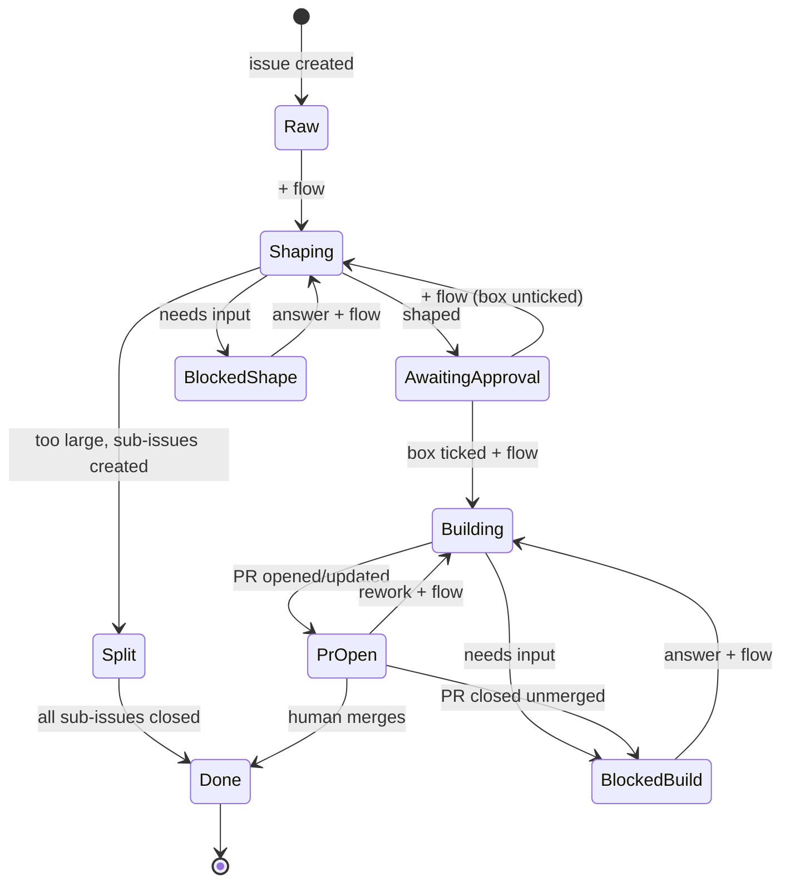

# issue-driven-flow

[English](README.md) | [日本語](README.ja.md)

[](https://github.com/4moda/issue-driven-flow/actions/workflows/ci.yml)

Issue-driven AI development for GitHub, shared across repositories.

Humans steer with **one label and one checkbox**: add `flow` to an issue to
run the next automated step; tick `ready for implementation` to approve
implementation. A coding agent — **Claude Code, Codex, or Gemini CLI**,
picked from the secrets you provide — runs inside GitHub Actions: the
**Composer** shapes raw issues into implementable specs, the **Crafter**
implements approved issues as pull requests. **Merging is always a human
action.** Internal `flow/*` state labels are managed entirely by
automation.



## Use it in a repository

One wrapper workflow, one credential, one label-setup run. See
[docs/adopting.md](docs/adopting.md).

## Where AI runs — and where it doesn't

AI is invoked in **exactly two steps**:

1. the Composer step of `shape.yml` (rewrite/split an issue), and
2. the Crafter step of `build.yml` (edit the working tree).

Everything else is deterministic scripting with `gh` and a unit-tested
Python module (`scripts/gf.py`): routing `flow` triggers by state label,
parsing the approval checkbox, creating sub-issues, committing/pushing and
opening PRs, and mirroring merge/close/review outcomes back to issues
(`sync-pr.yml` contains no AI at all). The agents themselves never call the
GitHub API — they only write result files that the workflows validate and
apply mechanically, so every state transition is explainable from logs.

## Security model

- **Credentials are the consumer's own.** Each consuming repository
  provides its own agent secret (`ANTHROPIC_API_KEY` /
  `CLAUDE_CODE_OAUTH_TOKEN`, `OPENAI_API_KEY`, or `GEMINI_API_KEY`) as a
  GitHub Actions secret; the workflows run the matching agent. This
  repository ships code only — it never receives, stores, or proxies
  anyone's tokens.
- **The agent credential is sent to its own vendor's API and nowhere
  else.** It is consumed by the vendor's official action
  ([`anthropics/claude-code-action`](https://github.com/anthropics/claude-code-action),
  [`openai/codex-action`](https://github.com/openai/codex-action), or
  [`google-github-actions/run-gemini-cli`](https://github.com/google-github-actions/run-gemini-cli))
  running on the consumer repository's own runner. The mechanical steps
  talk only to `github.com` with the run's `GITHUB_TOKEN`. GitHub masks
  secrets in logs.
- **`GITHUB_TOKEN` is ephemeral and least-privilege.** It expires when the
  job ends, and the wrapper workflow declares the minimum `permissions`
  per job (shape never gets `contents: write`; sync-pr never gets code
  access).
- **What leaves GitHub:** during the two AI steps, repository content and
  issue/PR text are sent to the selected agent's model API as context —
  that is inherent to running a coding agent. Web research tools
  (search/fetch) are also on by default so agents can verify external
  facts; disable them with `web_research: false` to keep agent runs
  offline apart from the model API. Nothing is sent anywhere during the
  mechanical steps.
- **Blast radius is bounded by design**: agents cannot push, merge, or
  label; the workflows do, deterministically, and merging is always left
  to a human. The checkout used for agent runs keeps no git credential
  (`persist-credentials: false`) — the workflow re-authenticates only in
  its own publish step — Codex and Gemini runs receive no GitHub token at
  all, and each agent runs under a tool allowlist (the Composer gets no
  shell; `git push`/`gh` are denied to the Crafter).

## How it works

- [skills/issue-driven-flow/SKILL.md](skills/issue-driven-flow/SKILL.md) — operating
  model, roles, design rules.
- [skills/issue-driven-flow/references/concepts.md](skills/issue-driven-flow/references/concepts.md)
  — state machine, routing table, invariants, edge cases.
- [skills/issue-driven-flow/references/composer.md](skills/issue-driven-flow/references/composer.md)
  / [crafter.md](skills/issue-driven-flow/references/crafter.md) — the fixed
  contracts the agents follow.

## Layout

| Path | Purpose |
|------|---------|
| `.github/workflows/shape.yml` | reusable workflow: shape an issue (Composer) |
| `.github/workflows/build.yml` | reusable workflow: implement an issue (Crafter) |
| `.github/workflows/sync-pr.yml` | reusable workflow: mirror PR outcomes to the issue; close a `flow/split` parent once every sub-issue closes |
| `.github/workflows/ci.yml` | tests + lint for this repository |
| `actions/route` | shared routing decision (wraps `scripts/gf.py`) |
| `actions/build-context` | collect issue/PR/repo context for agent runs |
| `actions/update-issue` | the only writer of `flow/*` labels, bodies, comments, and issue open/closed status |
| `actions/split-status` | resolve a closed issue's `flow/split` parent and whether every sub-issue is closed |
| `scripts/gf.py` | tested decision logic (state, ready checkbox, routing) |
| `scripts/setup-labels.sh` | create the `flow` + `flow/*` labels in a consumer repo |
| `skills/issue-driven-flow/` | skill document and agent contracts |
| `tests/` | unit tests for `gf.py` |

Reusable workflows live under `.github/workflows/` (a GitHub requirement
for `workflow_call`), not the `workflows/` directory originally sketched in
issue #1.

## Development

```bash
python3 -m unittest discover -s tests   # unit tests
pipx run ruff check scripts tests       # python lint
shellcheck scripts/*.sh                 # shell lint
actionlint                              # workflow lint
```

CI runs all four on every push and pull request.

## Releasing

Consumers pin a major tag (`@v2`, the current line), and the workflows'
internal action references use the same tag. Tagging is automated by
[`release.yml`](.github/workflows/release.yml):

- Every push to `main` that touches the product (reusable workflows,
  `actions/`, `scripts/`, `skills/`) is gated on tests + lint, tagged as a
  **patch** release (GitHub Release with generated notes), and the moving
  major tag is advanced. Docs/tests-only pushes never release.
- Put `[release:minor]` in the head commit message to make that push a
  **minor** release; `[release:skip]` suppresses the release.
- **Major** releases are manual by design — they need a
  backward-compatibility judgment. First land a commit updating the
  internal action refs (e.g. `@v2` → `@v3`) and docs, then run the
  `release` workflow via *Run workflow* with `bump: major`. The workflow
  refuses to tag while internal refs don't match the target line, and
  automatic patch releases skip themselves on major-prep commits.

Breaking changes (label names, result.json schema, wrapper inputs/secrets)
get a new major tag instead of moving the current one; the old line stays
frozen. History: `v1` (frozen at v1.3.0) used `ai` as the trigger label;
`v2` renamed it to `flow` and made it configurable.
