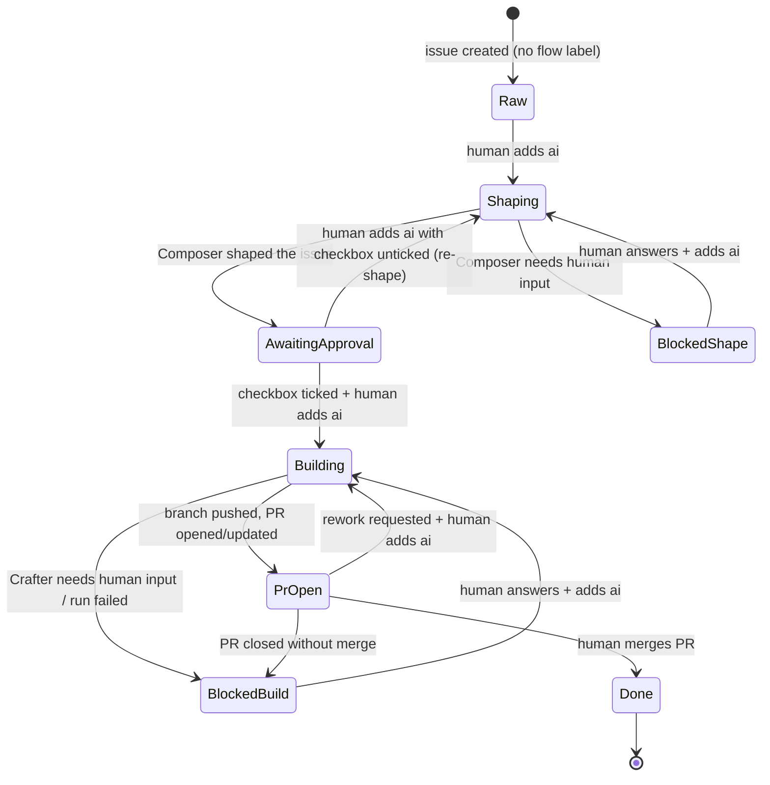

# github-flow — issue-driven AI execution for GitHub

`github-flow` turns GitHub Issues into a task pipeline that Claude works
through inside GitHub Actions. It lives in one shared repository; product
repositories consume it with a single thin wrapper workflow.

## Operating model in one paragraph

A human opens an issue and adds the **`ai`** label whenever they want the
next automated step to run. The first run **shapes** the issue: the Composer
rewrites it into a fixed template with acceptance criteria. The human
reviews the shaped issue, ticks **`ready for implementation`**, and adds
`ai` again; the Crafter implements the issue on a branch and opens a pull
request. Humans review and merge — automation never merges. Progress is
tracked with internal `flow/*` state labels that only the workflows touch.

## Control surface

| Who | Touches | Meaning |
|-----|---------|---------|
| Human | `ai` label | "run the next step now" |
| Human | `ready for implementation` checkbox | approval to implement |
| Automation | `flow/*` labels | current state; at most one per issue |

Humans never add or remove `flow/*` labels. Every `ai` trigger is answered
exactly once — with a run or with an explanatory comment — and the `ai`
label is always removed by automation afterwards.

## Roles

| Role | Runs in | Contract |
|------|---------|----------|
| **Composer** | `shape.yml` | [references/composer.md](references/composer.md) — rewrites the issue into the fixed template; never touches code |
| **Crafter** | `build.yml` | [references/crafter.md](references/crafter.md) — edits the working tree; the workflow commits, pushes, and opens the PR |

There is no AI reviewer role. Review and merge are human responsibilities.

Both roles follow the same execution pattern: the workflow collects context
into files, the agent reads its contract and writes result files, and the
workflow applies those results to GitHub deterministically. The agents never
call the GitHub API themselves.

## Lifecycle



State semantics, invariants, and edge cases:
[references/concepts.md](references/concepts.md)

## Workflows

| Workflow | Trigger (in consumer repo) | Acts when | Does |
|----------|---------------------------|-----------|------|
| `shape.yml` | `issues: [labeled]` with `ai` | no state label, `flow/blocked-shape`, or `flow/awaiting-approval` with checkbox unticked | runs Composer, rewrites issue body, transitions state; also acknowledges `ai` in states no workflow handles |
| `build.yml` | `issues: [labeled]` with `ai` | `flow/awaiting-approval` + checkbox ticked, `flow/blocked-build`, `flow/pr-open` | runs Crafter, commits/pushes `flow/issue-<n>`, opens or updates the PR |
| `sync-pr.yml` | `pull_request: [closed, reopened]`, `pull_request_review: [submitted]` | PR head branch is `flow/issue-<n>` | mirrors merge/close/reopen/changes-requested back to the issue |

Routing between shape and build is a single tested function
(`scripts/gf.py route`), so exactly one workflow responds to any `ai`
trigger.

## Consuming from another repository

Consumers add one wrapper workflow, the labels, and an API credential.
Complete instructions with a copy-paste wrapper:
[docs/adopting.md](../../docs/adopting.md)

## Repository layout

```
skills/github-flow/       this skill and the agent contracts
  references/composer.md    Composer (shaping) contract
  references/crafter.md     Crafter (implementation) contract
  references/issue-template.md  shaped-issue body format
  references/concepts.md    state machine and invariants
.github/workflows/        reusable workflows (shape, build, sync-pr) + CI
actions/                  composite actions (route, build-context, update-issue)
scripts/                  gf.py decision logic, setup-labels.sh
tests/                    unit tests for gf.py
docs/adopting.md          consumer setup guide
```

## Design rules

1. **Merge is always human.** No workflow or agent merges, ever.
2. **At most one `flow/*` label per issue** — enforced by `update-issue`,
   which is the only writer of state labels.
3. **Deterministic apply.** Agents write files; workflows apply them with
   `gh`. Agents never mutate GitHub state directly.
4. **Every `ai` add gets exactly one response** (a run or a comment), and
   automation removes the label afterwards.
5. **Blocked states always come with a comment** saying precisely what human
   input is missing and how to resume.
